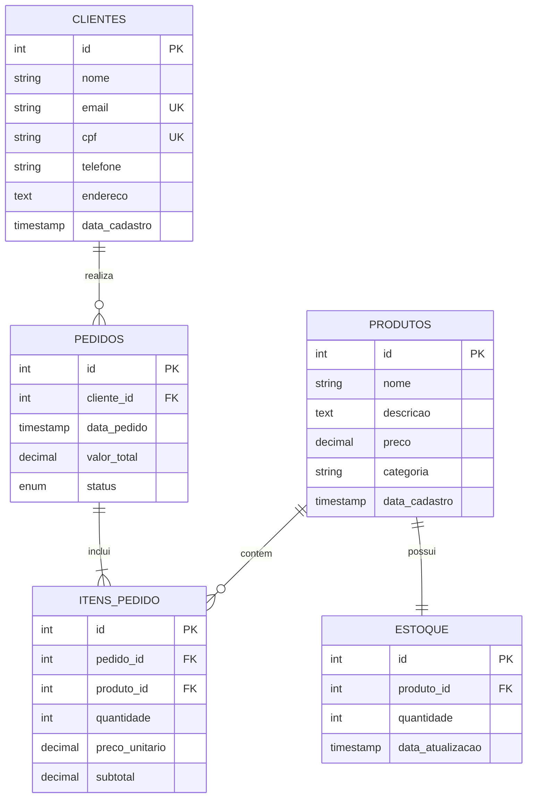

# DNCommerce - Sistema de Gerenciamento de E-commerce

Sistema backend completo para gerenciamento de estoque e pedidos de produtos de beleza, desenvolvido com Node.js, Express, tRPC e MySQL.

---

## 📋 Índice

- [Sobre o Projeto](#sobre-o-projeto)
- [Tecnologias Utilizadas](#tecnologias-utilizadas)
- [Modelagem do Banco de Dados](#modelagem-do-banco-de-dados)
- [Instalação](#instalação)
- [Uso da API](#uso-da-api)
- [Testes](#testes)
- [Estrutura do Projeto](#estrutura-do-projeto)

---

## 🎯 Sobre o Projeto

O **DNCommerce** é um sistema backend robusto projetado para gerenciar operações de e-commerce, com foco em produtos de beleza. O sistema oferece funcionalidades completas de CRUD para produtos, clientes, pedidos e controle de estoque, além de integração automática entre vendas e atualização de estoque.

### Funcionalidades Principais

O sistema implementa as seguintes funcionalidades essenciais para operação de um e-commerce:

**Gestão de Produtos**: Permite o cadastro completo de produtos com informações como nome, descrição, preço e categoria. Cada produto é automaticamente vinculado a uma entrada de estoque no momento da criação, garantindo rastreabilidade desde o início.

**Gestão de Clientes**: Oferece controle total sobre o cadastro de clientes, incluindo dados pessoais, informações de contato e endereço. O sistema garante unicidade através de validações de CPF e email.

**Controle de Estoque**: Mantém registro preciso da quantidade disponível de cada produto. O estoque é atualizado automaticamente quando pedidos são criados, prevenindo vendas de produtos indisponíveis através de validações em tempo real.

**Processamento de Pedidos**: Gerencia todo o ciclo de vida dos pedidos, desde a criação até a entrega. Cada pedido calcula automaticamente o valor total, registra os itens vendidos e atualiza o estoque correspondente. O sistema também permite acompanhamento através de diferentes status (pendente, processando, enviado, entregue, cancelado).

---

## 🛠️ Tecnologias Utilizadas

| Tecnologia | Versão | Descrição |
|------------|--------|-----------|
| **Node.js** | 22.13.0 | Runtime JavaScript para o servidor |
| **TypeScript** | 5.9.3 | Superset tipado de JavaScript |
| **Express** | 4.21.2 | Framework web minimalista |
| **tRPC** | 11.6.0 | Framework para APIs type-safe |
| **Drizzle ORM** | 0.44.5 | ORM moderno para TypeScript |
| **MySQL** | 8.0+ | Sistema de gerenciamento de banco de dados |
| **Zod** | 4.1.12 | Biblioteca de validação de schemas |
| **Vitest** | 2.1.4 | Framework de testes unitários |

---

## 📊 Modelagem do Banco de Dados

O banco de dados foi modelado seguindo princípios de normalização e integridade referencial. A estrutura contempla cinco entidades principais com relacionamentos bem definidos.

### Diagrama Entidade-Relacionamento



### Descrição das Entidades

**Clientes**: Armazena informações dos clientes do sistema. Os campos `email` e `cpf` possuem constraint de unicidade para evitar duplicações. O campo `data_cadastro` é preenchido automaticamente no momento da inserção.

**Produtos**: Mantém o catálogo de produtos disponíveis. O campo `preco` utiliza tipo `DECIMAL(10,2)` para garantir precisão em valores monetários. A `categoria` permite agrupamento lógico dos produtos.

**Estoque**: Relacionamento um-para-um com Produtos. Cada produto possui exatamente uma entrada de estoque. O campo `data_atualizacao` é atualizado automaticamente sempre que a quantidade é modificada.

**Pedidos**: Registra as vendas realizadas. O campo `status` é um enum com cinco valores possíveis (pendente, processando, enviado, entregue, cancelado), permitindo rastreamento do ciclo de vida do pedido. O `valor_total` é calculado automaticamente pela soma dos subtotais dos itens.

**Itens do Pedido**: Tabela associativa que implementa o relacionamento muitos-para-muitos entre Pedidos e Produtos. Armazena a quantidade vendida, o preço unitário no momento da venda (importante para histórico) e o subtotal calculado.

---

## 🚀 Instalação

### Pré-requisitos

Antes de iniciar, certifique-se de ter instalado em seu ambiente:

- Node.js versão 22.13.0 ou superior
- pnpm (gerenciador de pacotes recomendado)
- MySQL 8.0 ou superior
- Git para clonar o repositório

### Passo a Passo

**1. Clone o repositório**

```bash
git clone <url-do-repositorio>
cd analise-modelo-biblioteca
```

**2. Instale as dependências**

```bash
pnpm install
```

**3. Configure as variáveis de ambiente**

O sistema utiliza variáveis de ambiente para configuração. As principais variáveis necessárias são:

- `DATABASE_URL`: String de conexão com o banco MySQL
- `JWT_SECRET`: Chave secreta para assinatura de tokens
- `VITE_APP_ID`: Identificador da aplicação

As demais variáveis são injetadas automaticamente pela plataforma Manus.

**4. Execute as migrações do banco de dados**

```bash
pnpm db:push
```

Este comando irá:
- Gerar os arquivos de migração baseados no schema
- Aplicar as migrações no banco de dados
- Criar todas as tabelas e relacionamentos

**5. Inicie o servidor de desenvolvimento**

```bash
pnpm dev
```

O servidor estará disponível em `http://localhost:3000`

---

## 📡 Uso da API

A API utiliza tRPC, que oferece type-safety completo entre cliente e servidor. Todos os endpoints são acessíveis através do prefixo `/api/trpc`.

### Clientes

#### Criar Cliente

```typescript
const result = await trpc.clientes.create.mutate({
  nome: "Maria Silva",
  email: "maria@example.com",
  cpf: "12345678901",
  telefone: "11987654321",
  endereco: "Rua das Flores, 123"
});
```

**Resposta:**
```json
{
  "success": true,
  "message": "Cliente criado com sucesso"
}
```

#### Listar Todos os Clientes

```typescript
const clientes = await trpc.clientes.list.query();
```

**Resposta:**
```json
[
  {
    "id": 1,
    "nome": "Maria Silva",
    "email": "maria@example.com",
    "cpf": "12345678901",
    "telefone": "11987654321",
    "endereco": "Rua das Flores, 123",
    "dataCadastro": "2026-02-04T10:30:00.000Z"
  }
]
```

#### Buscar Cliente por ID

```typescript
const cliente = await trpc.clientes.getById.query({ id: 1 });
```

#### Atualizar Cliente

```typescript
const result = await trpc.clientes.update.mutate({
  id: 1,
  telefone: "11999887766"
});
```

#### Deletar Cliente

```typescript
const result = await trpc.clientes.delete.mutate({ id: 1 });
```

### Produtos

#### Criar Produto

```typescript
const result = await trpc.produtos.create.mutate({
  nome: "Shampoo Hidratante 500ml",
  descricao: "Shampoo para cabelos secos e danificados",
  preco: "39.90",
  categoria: "Cabelos"
});
```

**Resposta:**
```json
{
  "success": true,
  "message": "Produto criado com sucesso",
  "id": 1
}
```

**Observação**: Ao criar um produto, uma entrada de estoque com quantidade zero é criada automaticamente.

#### Listar Todos os Produtos

```typescript
const produtos = await trpc.produtos.list.query();
```

#### Buscar Produto por ID

```typescript
const produto = await trpc.produtos.getById.query({ id: 1 });
```

#### Atualizar Produto

```typescript
const result = await trpc.produtos.update.mutate({
  id: 1,
  preco: "44.90"
});
```

#### Deletar Produto

```typescript
const result = await trpc.produtos.delete.mutate({ id: 1 });
```

### Estoque

#### Listar Todo o Estoque

```typescript
const estoque = await trpc.estoque.list.query();
```

**Resposta:**
```json
[
  {
    "id": 1,
    "produtoId": 1,
    "quantidade": 150,
    "dataAtualizacao": "2026-02-04T11:00:00.000Z"
  }
]
```

#### Consultar Estoque de um Produto

```typescript
const item = await trpc.estoque.getByProdutoId.query({ produtoId: 1 });
```

#### Atualizar Quantidade em Estoque

```typescript
const result = await trpc.estoque.update.mutate({
  id: 1,
  quantidade: 200
});
```

### Pedidos

#### Criar Pedido (Registrar Venda)

```typescript
const result = await trpc.pedidos.create.mutate({
  clienteId: 1,
  itens: [
    {
      produtoId: 1,
      quantidade: 2,
      precoUnitario: "39.90"
    },
    {
      produtoId: 2,
      quantidade: 1,
      precoUnitario: "25.50"
    }
  ]
});
```

**Resposta:**
```json
{
  "success": true,
  "message": "Pedido criado com sucesso",
  "pedidoId": 1,
  "valorTotal": "105.30"
}
```

**Comportamento**: O sistema automaticamente:
1. Calcula o valor total do pedido
2. Cria o registro do pedido
3. Registra cada item do pedido
4. Atualiza o estoque, diminuindo as quantidades vendidas
5. Valida se há estoque suficiente antes de processar

#### Listar Todos os Pedidos

```typescript
const pedidos = await trpc.pedidos.list.query();
```

#### Buscar Pedido por ID (com itens)

```typescript
const pedido = await trpc.pedidos.getById.query({ id: 1 });
```

**Resposta:**
```json
{
  "id": 1,
  "clienteId": 1,
  "dataPedido": "2026-02-04T12:00:00.000Z",
  "valorTotal": "105.30",
  "status": "pendente",
  "itens": [
    {
      "id": 1,
      "pedidoId": 1,
      "produtoId": 1,
      "quantidade": 2,
      "precoUnitario": "39.90",
      "subtotal": "79.80"
    }
  ]
}
```

#### Atualizar Status do Pedido

```typescript
const result = await trpc.pedidos.updateStatus.mutate({
  id: 1,
  status: "enviado"
});
```

**Status disponíveis**: `pendente`, `processando`, `enviado`, `entregue`, `cancelado`

---

## 🧪 Testes

O projeto inclui uma suíte completa de testes unitários utilizando Vitest. Os testes cobrem todas as funcionalidades principais da API.

### Executar os Testes

```bash
pnpm test
```

### Cobertura de Testes

A suíte de testes inclui:

**Testes de Clientes**:
- Criação de novo cliente
- Listagem de todos os clientes
- Busca de cliente por ID
- Atualização de dados do cliente
- Deleção de cliente

**Testes de Produtos**:
- Criação de novo produto (com criação automática de estoque)
- Listagem de todos os produtos
- Busca de produto por ID
- Atualização de dados do produto
- Deleção de produto

**Testes de Estoque**:
- Listagem de todo o estoque
- Consulta de estoque por produto
- Atualização de quantidade em estoque

**Testes de Pedidos**:
- Criação de pedido com atualização automática de estoque
- Listagem de todos os pedidos
- Busca de pedido por ID com itens
- Atualização de status do pedido
- Validação de estoque insuficiente

### Resultado dos Testes

```
Test Files  2 passed (2)
     Tests  17 passed (17)
  Duration  1.47s
```

Todos os testes passam com sucesso, garantindo a confiabilidade do sistema.

---

## 📁 Estrutura do Projeto

```
analise-modelo-biblioteca/
├── client/                      # Frontend (React)
│   ├── public/                  # Arquivos estáticos
│   └── src/
│       ├── components/          # Componentes reutilizáveis
│       ├── pages/              # Páginas da aplicação
│       └── lib/                # Configurações (tRPC client)
│
├── server/                      # Backend (Node.js + Express)
│   ├── _core/                  # Código core do framework
│   │   ├── context.ts          # Contexto tRPC
│   │   ├── trpc.ts             # Configuração tRPC
│   │   └── ...
│   ├── db.ts                   # Helpers de banco de dados
│   ├── routers.ts              # Definição de rotas tRPC
│   └── dncommerce.test.ts      # Testes unitários
│
├── drizzle/                     # Configuração do ORM
│   ├── schema.ts               # Definição do schema
│   └── migrations/             # Arquivos de migração
│
├── shared/                      # Código compartilhado
│   ├── const.ts                # Constantes
│   └── types.ts                # Tipos TypeScript
│
├── package.json                 # Dependências do projeto
├── tsconfig.json               # Configuração TypeScript
├── vitest.config.ts            # Configuração de testes
└── README.md                   # Este arquivo
```

### Arquivos Principais

**`server/routers.ts`**: Define todos os endpoints da API usando tRPC. Cada rota é tipada e validada com Zod.

**`server/db.ts`**: Contém as funções auxiliares para interação com o banco de dados usando Drizzle ORM.

**`drizzle/schema.ts`**: Define o schema do banco de dados, incluindo todas as tabelas, colunas, tipos e relacionamentos.

**`server/dncommerce.test.ts`**: Suite completa de testes unitários cobrindo todas as funcionalidades da API.

---

## 🎓 Considerações Técnicas

### Decisões de Design

**Type Safety**: O uso de tRPC garante que cliente e servidor compartilhem os mesmos tipos, eliminando erros de comunicação em tempo de compilação.

**Validação**: Todas as entradas são validadas usando Zod antes de serem processadas, garantindo integridade dos dados.

**Transações Implícitas**: Operações críticas como criação de pedidos são atômicas, garantindo consistência mesmo em caso de falha parcial.

**Timestamps Automáticos**: Campos de data são gerenciados automaticamente pelo banco de dados, evitando inconsistências de timezone.

### Melhorias Futuras

Possíveis expansões do sistema incluem:

- Implementação de autenticação e autorização baseada em roles
- Sistema de notificações para clientes sobre status de pedidos
- Relatórios e dashboards de vendas
- Integração com gateways de pagamento
- Sistema de cupons e promoções
- Gestão de fornecedores e compras
- Histórico de alterações de preços
- API de busca avançada com filtros

---

## 📄 Licença

Este projeto foi desenvolvido como parte de um desafio técnico e está disponível sob a licença MIT.

---

## 👨‍💻 Autor

**Manus AI**

Sistema desenvolvido utilizando as melhores práticas de desenvolvimento backend, com foco em escalabilidade, manutenibilidade e type-safety.
